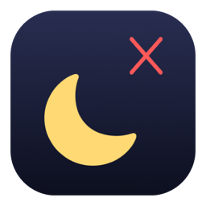
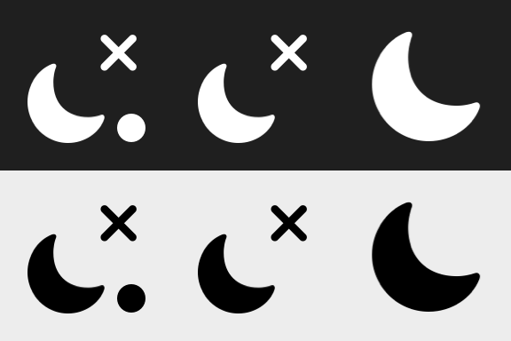

<p align="center"></p>

# Insomnia

A tiny, free macOS menu bar app that keeps your laptop awake. One click to toggle. Built for people who run long jobs, agents, renders or servers on a MacBook and don't want it dozing off.

<p align="center"></p>

| Icon | Meaning |
|------|---------|
| moon with a cross | Insomnia is **on**. The Mac will not idle-sleep. |
| moon, cross and a dot | On, and the lid override is live right now. |
| plain moon | Insomnia is **off**. Normal sleep behaviour. |

## Install

**One line** (builds from source in a few seconds, needs only Apple's Command Line Tools):

```sh
curl -fsSL https://raw.githubusercontent.com/FRIKKern/insomnia/main/install.sh | sh
```

**Homebrew:**

```sh
brew install frikkern/tap/insomnia
```

**Download:** grab `Insomnia.app.zip` from the [latest release](https://github.com/FRIKKern/insomnia/releases/latest), unzip, move to Applications. The app is not notarised, so the first launch needs a right-click → Open. Building from source (the two methods above) avoids that entirely.

Requirements: macOS 13 or newer, Apple Silicon or Intel.

### Options for the one-liner

Set as environment variables so they work through a pipe:

| Variable | Effect |
|----------|--------|
| `INSOMNIA_LOGIN=1` | also register Launch at Login |
| `INSOMNIA_LID=1` | also enable Keep Awake With Lid Closed (one admin password prompt) |
| `INSOMNIA_NO_LAUNCH=1` | install only, don't start |
| `INSOMNIA_REF=v1.0.0` | install a specific tag instead of `main` |

```sh
curl -fsSL https://raw.githubusercontent.com/FRIKKern/insomnia/main/install.sh | INSOMNIA_LOGIN=1 sh
```

### Uninstall

```sh
curl -fsSL https://raw.githubusercontent.com/FRIKKern/insomnia/main/uninstall.sh | sh
```

Removes the app, preferences, login item, and the optional sudo rule. Restores normal lid sleep.

## Use

- **Left-click** the moon: toggle.
- **Right-click** (or ctrl-click): menu with *Prevent Sleep*, *Keep Awake With Lid Closed*, *Lid Override on Battery*, *Launch at Login*, *Quit*.
- The display may still dim and turn off. That is intended: it saves battery while the system, network and your terminal sessions keep running.
- State is remembered across restarts. Default on first launch is **on**.

### Scriptable

Any shell, script or agent can drive Insomnia through a URL scheme. No Accessibility permission needed.

```sh
open insomnia://on
open insomnia://off
open insomnia://toggle
open insomnia://lid-on        # enable Keep Awake With Lid Closed, no confirmation dialog
open insomnia://lid-off
open insomnia://login-on      # register Launch at Login
open insomnia://login-off
open insomnia://update        # check for updates (shows a dialog)
open insomnia://quit          # clean quit, restores normal lid sleep
```

Verify what the OS sees:

```sh
pmset -g assertions | grep Insomnia      # the two sleep assertions while on
pmset -g | grep SleepDisabled            # 1 while the lid override is live
```

## For agents

If you are an AI agent installing Insomnia on a user's Mac, this is the whole procedure:

```sh
# install, start, and register at login; non-interactive
curl -fsSL https://raw.githubusercontent.com/FRIKKern/insomnia/main/install.sh | INSOMNIA_LOGIN=1 sh

# verify
pmset -g assertions | grep -q "Insomnia keeps" && echo OK
```

The lid override (`INSOMNIA_LID=1` or `open insomnia://lid-on`) triggers a macOS admin password dialog on the user's screen the first time. Tell the user before triggering it. Everything else is silent. Bundle id `no.guerrilla.insomnia`, preferences readable with `defaults read no.guerrilla.insomnia`.

## Lid closed

*Keep Awake With Lid Closed* sets `pmset -a disablesleep 1`, which is root-only. The first time you enable it, Insomnia asks for your password once and writes `/etc/sudoers.d/insomnia`, a rule that allows exactly two commands without a password:

```
<you> ALL=(root) NOPASSWD: /usr/bin/pmset -a disablesleep 1, /usr/bin/pmset -a disablesleep 0
```

After that the toggle is silent. The override is active only while Insomnia is **on**, the lid setting is **on**, and no guard is pausing it. Switching Insomnia off, or quitting, clears it, so the laptop sleeps normally on lid close again. On every launch Insomnia compares the OS setting with its own preferences and repairs it, so a crash or forced kill is healed at the next start.

Running with the lid shut inside a bag makes the machine warm. The guards below exist for that. Remove the rule any time with `sudo rm /etc/sudoers.d/insomnia`.

### Guards on battery

The lid override pauses on battery when any of these trips, and re-arms when the charger returns. Plain idle-sleep prevention is never affected. All are in the *Lid Override on Battery* submenu, which also shows the live state, for example "Unplugged 42 min · battery 63% · lid closed · thermal nominal · online".

| Guard | Default | Options |
|-------|---------|---------|
| battery at or below | 20% | 10, 20, 30, 40, 50 |
| unplugged longer than | 2 hours | 30 min, 1 h, 2 h, 4 h, never |
| offline longer than | 15 min | 5, 15, 30 min, 1 h, **never** |
| hot with the lid closed | on | on / off |

- **Unplugged**: pulling the charger does not pause the override straight away, so moving rooms or an hour on battery keeps working. The clock is persisted across relaunch.
- **Offline**: agents need a network. Connectivity comes from the system reachability API, which covers Wi-Fi, Ethernet and tethering. Pick *never* to finish a render or build while moving with no network.
- **Hot with the lid closed**: the bag guard. Insomnia watches the system thermal state, the same nominal / fair / serious / critical signal macOS throttles on, and the kernel's clamshell flag. Shut, on battery, at *serious* or worse, the override pauses so the Mac can sleep and cool. That pause is **held** until the lid opens or the charger returns, so a laptop that cools and reheats cannot oscillate.

Test hooks for simulating states without unplugging, heating or disconnecting anything:

```sh
defaults write no.guerrilla.insomnia insomnia.debug.power   battery:15   # or: ac
defaults write no.guerrilla.insomnia insomnia.debug.lid     closed       # or: open
defaults write no.guerrilla.insomnia insomnia.debug.thermal serious      # nominal | fair | serious | critical
defaults write no.guerrilla.insomnia insomnia.debug.net     offline      # or: online
defaults delete no.guerrilla.insomnia insomnia.debug.power              # back to real readings; same for the others
```

## Updates

The *Updates* submenu shows your version and *Check for Updates…*. Once a day Insomnia quietly asks GitHub for the latest release and, if there is one, the menu shows *Update to X.Y.Z…*. Choosing it runs the same installer as above: builds the new version from source on your Mac and relaunches. No password, no Gatekeeper prompt. Turn the daily check off with *Check Daily*. Scripts can trigger a check with `open insomnia://update` and read `defaults read no.guerrilla.insomnia insomnia.availableVersion`.

## How it works

Insomnia holds the same two IOKit power assertions as `caffeinate -i -s`: `PreventUserIdleSystemSleep` always, and `PreventSystemSleep`, which macOS honours on AC only. It is one Objective-C file with no dependencies, so it builds with clang from the Command Line Tools alone. No Xcode, no Swift toolchain, no package manager.

## Build from a checkout

```sh
git clone https://github.com/FRIKKern/insomnia.git && cd insomnia
./build.sh                 # universal build, installs to ~/Applications
./build.sh --no-install    # just build into build/Insomnia.app
```

Run the guard matrix against the running app (uses the debug hooks, needs the sudo rule for the lid tests):

```sh
./test.sh
```

Cut a release (bumps the version, tags, pushes; CI attaches the zip and the tap updates itself):

```sh
./release.sh 1.2.0
```

See [CHANGELOG.md](CHANGELOG.md), [CONTRIBUTING.md](CONTRIBUTING.md), [SECURITY.md](SECURITY.md) and, for AI agents, [AGENTS.md](AGENTS.md).

Regenerate the app icon (only if you change `tools/mkicon.m`):

```sh
clang -fobjc-arc -framework Cocoa tools/mkicon.m -o build/mkicon && ./build/mkicon
iconutil -c icns build/AppIcon.iconset -o AppIcon.icns
```

## Limits

- An empty battery is not a sleep problem Insomnia can solve. Plug in for long runs.
- A crash or forced kill leaves the lid override set until the next launch heals it. `sudo pmset -a disablesleep 0` clears it by hand.
- Not notarised. The one-liner and Homebrew build locally, which sidesteps Gatekeeper. The release zip needs a right-click → Open once.

## License

MIT. Made by [Frikk Jarl](https://github.com/FRIKKern).
